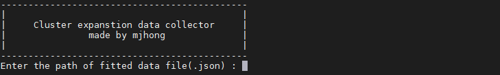
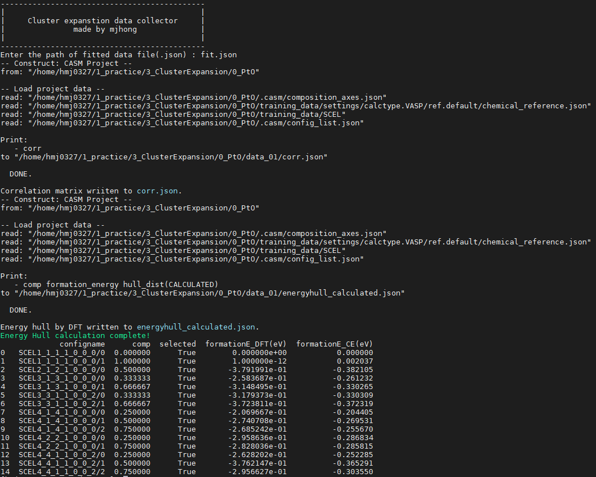
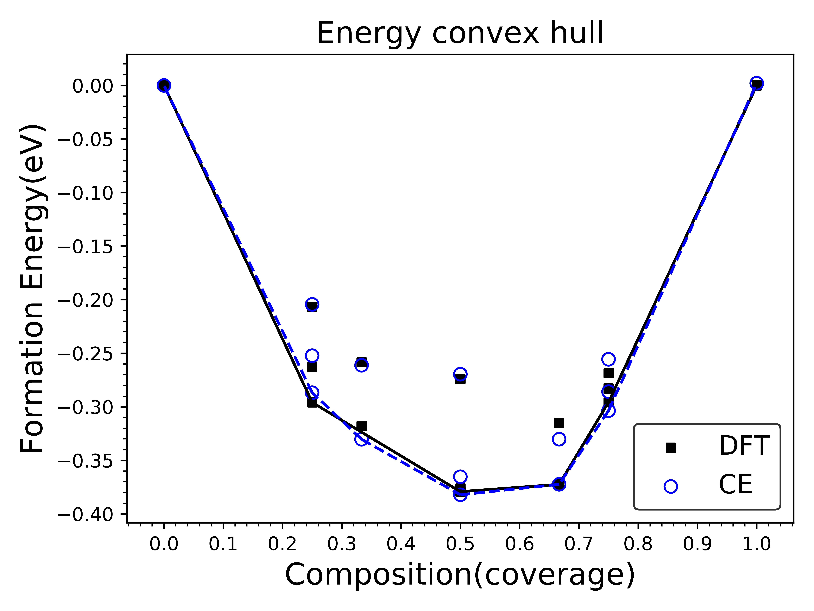

# CASM_visulize

- Required files : `eci.json` for ECI and `fit_blahblah.json` for fitting info.
- Run by command `CE_dataquery` by adding this file to `PATH`
- Or run this command `python3 CE_dataquery.py` with copying file into your working directory.
- At first run, you see:

- When done, correlation matrix is written in `corr.json` and energy hull by DFT is written in `energyHull_calculated.json`.
- Finally, full energy hull data is written into `energyHull.csv`.

## 2.Plot Energy Convex Hull

- Required file : only `energyHull.csv`
- Run by `python2 CE_plotEnergyHull.py`.
- Sample of energy convex hull plot

